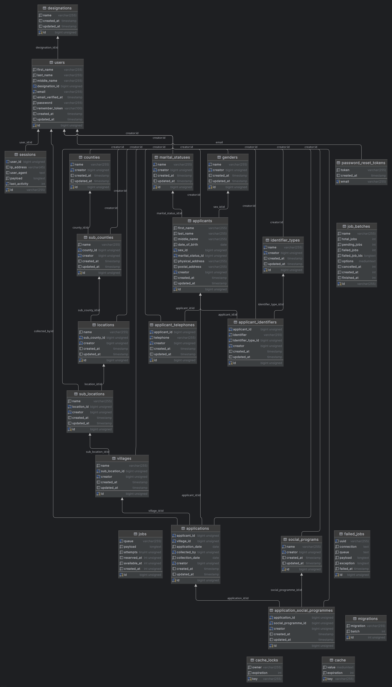

# Social Assistance Fund Management System
This is a web application that helps in managing the social assistance funds provided by the government to the citizens. The application allows the government to allocate funds to different categories, manage beneficiaries, and track the disbursement of funds. It also provides reports and analytics to help in decision-making and monitoring the fund distribution.

# Setting up PHP, Composer, and Laravel

This guide will walk you through the process of setting up PHP, Composer, and Laravel on your system. Additionally, it will cover how to copy the `.env.example` file to `.env`, make necessary changes, and perform migrations and seeding. 

## Prerequisites
Before you begin, make sure you have the following installed on your system:

1. PHP: Install PHP 8.2.0 by following the official documentation.
2. Composer: Install Composer by following the official documentation.
3. Git: Install Git by following the official documentation.
4. Laravel: Install Laravel 11 by following the official documentation.
5. MySQL: Install MySQL by following the official documentation.
6. Ubuntu: Install Ubuntu 20.04 LTS by following the official documentation.


### Note:
This guide assumes that you have PHP, Composer, Git, Laravel, MySQL, and Ubuntu installed on your system. If you haven't installed these tools yet, please refer to the official documentation for installation instructions.

Also note this was being developed on a Mac, and did not manage to install the old version of PHP as is required.

## Step 1: Clone the Project
1. Open your terminal and navigate to the directory where you want to clone the project.
2. Run the following command to clone the project:
    ```
    git clone https://github.com/Skipper-116/saf.git
    ```

## Step 2: Copy `.env.example` to `.env`
1. In the project directory, locate the `.env.example` file.
2. Make a copy of the file and rename it to `.env`.
3. Open the `.env` file and update the necessary values, such as database credentials and application settings.

## Step 3: Install Dependencies
1. Navigate to the project directory in your terminal.
2. Run the following command to install the project dependencies using Composer:
    ```
    composer install
    ```

## Step 4: Generate Application Key
1. In the terminal, navigate to the project directory.
2. Run the following command to generate the application key:
    ```
    php artisan key:generate
    ```

## Step 5: Migrate and Seed the Database
1. In the terminal, navigate to the project directory.
2. Run the following command to migrate the database:
    ```
    php artisan migrate
    ```
3. To seed the database with sample data, run the following command:
    ```
    php artisan db:seed
    ```

## Step 6: Start the Laravel Project
1. In the terminal, navigate to the project directory.
2. Run the following command to start the Laravel development server:
    ```
    php artisan serve
    ```
    This will start the server at `http://localhost:8000`.

### Note:
Alternatively, you can use the following command to start the server:
```bash
sh start.sh
```

## Step 7: Default User Credentials
After seeding the database, you can use the following default user credentials to log in to the application:
```php
Email: test@example.com
Password: password
```

Congratulations! You have successfully set up PHP, Composer, and Laravel, and started your Laravel project. You can now access your Laravel application in your web browser.


## Database Design
The database design for the Social Assistance Fund Management System consists of the following tables:

